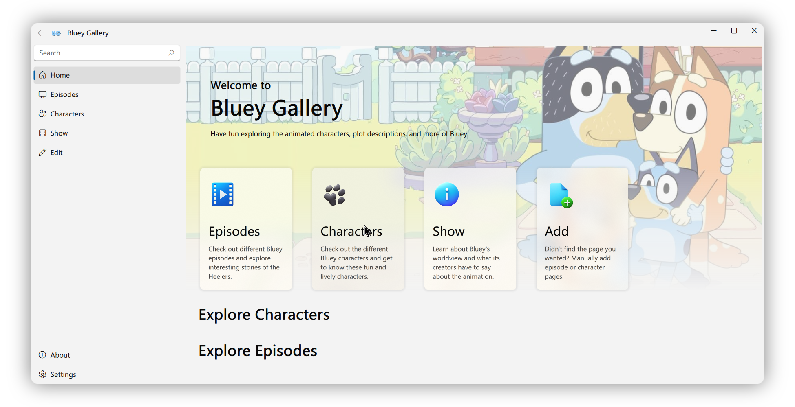

## Bluey Gallery

[切换到中文](README_Assets/README_zh-CN.md)

> [!warning]
> The project is still in development, please be patient.

### Introduction

This is a Bluey Gallery App based on QML, C++ and SQLite. Using open source UI component libraries [FluentUI - zhuzichu520](https://github.com/zhuzichu520/FluentUI). Currently, only Windows platforms are supported.

This project is a **School Project**, therefore long-term maintenance is NOT planned at this time.

### How to Use

- For regular users, please be patient and wait for the first version of `Release`;

- For the more hands-on user, you can clone the repository locally and open it with `Qt Creator`. Please note: this project requires at least `Qt 6.4` to compile.

### Feature

1. A **FluentUI-like** appearance with elegant and clean typography and layout;
2. **Card Component** display of the database content, in line with the reading habits, catch the eye;
3. Software support **Chinese and English switching** (the database itself contains only Chinese);

### Roadmap:

- [ ] **[PRIORITY]** Adding and editing database entries;
- [ ] Restore original database;
- [ ] Creator's commentary (Show page)
- [ ] *[optiopnal]* Database search;
- [x] Randomized display of entries on the home page;
- [x] Independent page display for Character and Episode items;
- [x] Relational database display;

