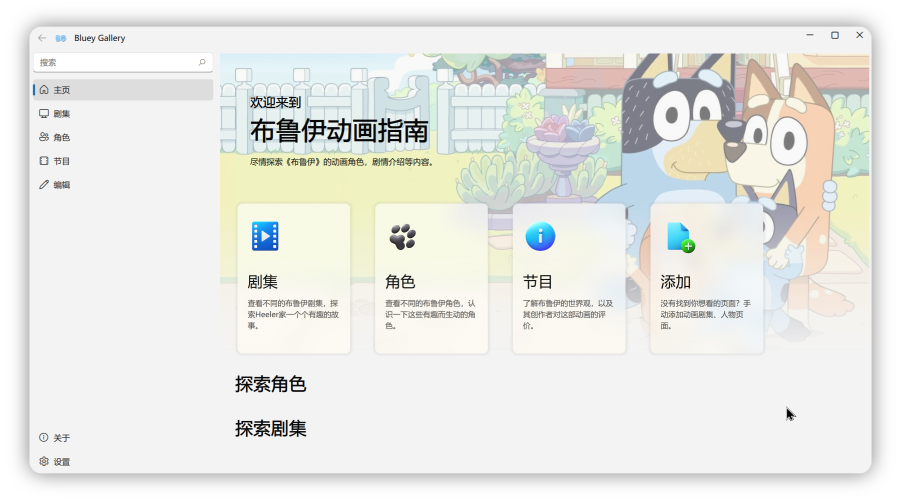

## Bluey Gallery

> [!warning]
> 该项目仍在开发中，请耐心等候。

### 简介

这是一个基于 QML，C++ 和 SQLite 的布鲁伊动画指南 App 。使用开源 UI 组件库 [FluentUI - zhuzichu520](https://github.com/zhuzichu520/FluentUI) 。目前仅支持 Windows 平台。

本项目为**学校作业**，因此暂不计划长期维护。

### 如何使用

- 对于普通用户，请耐心等待第一版 `Release`；

- 对于动手能力较强的用户，可以将仓库Clone到本地，并使用 `Qt Creator` 打开。本项目需要至少 `Qt 6.4` 才能编译运行。

### 功能一览

1. 类 **FluentUI** 外观，排版优雅简洁；
2. 对数据库内容进行**卡片式**展示，符合阅读习惯，抓住眼球；
3. 软件支持**中英文切换**（数据库本身仅包含中文）；

### 更新计划

- [ ] **[优先]** 数据库条目的添加、编辑；
- [ ] 恢复初始数据库；
- [ ] 主创评论（节目页面）；
- [ ] *[可选]* 数据库检索；
- [x] 首页随机展示条目；
- [x] 角色与剧集项目的单独页面显示；
- [x] 关系数据库的展示；
